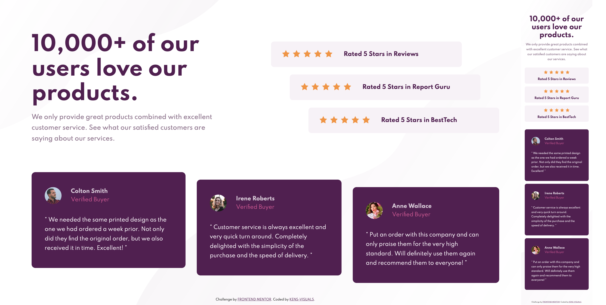

# Frontend Mentor - Social Proof Section solution

This is a solution to the [Social Proof Section Challenge on Frontend Mentor](https://www.frontendmentor.io/challenges/social-proof-section-6e0qTv_bA).

## Table of contents

- [Overview](#overview)
  - [The challenge](#the-challenge)
  - [Screenshot](#screenshot)
  - [Links](#links)
- [My process](#my-process)
  - [Built with](#built-with)
  - [Continued development](#continued-development)
  - [Useful resources](#useful-resources)
- [Author](#author)

## Overview

### The challenge

Users should be able to:

- View the optimal layout for the section depending on their device's screen size

### Screenshot

### Links

- Solution URL: [TBU](https://your-solution-url.com)
- Live Site URL: [TBU](https://your-live-site-url.com)

## My process

### Built with

- Semantic HTML5 markup
- CSS Grid
- CSS Flexbox
- CSS Animations
- SCSS custom properties
- Mobile-first workflow

### Continued development

I experimented with CSS grid in this project, and I'm really excited to practice it more in my future pojects. I'm going to build much more complex layouts, which will be really fun with Css grid.

### Useful resources

- [animista](https://animista.net/) - Animista is a great website for small and simple CSS animations. After twitching a little bit I made what I wanted, really fast and really simple.
- [CSS Grid Cheatsheet](https://yoksel.github.io/grid-cheatsheet/) - This is a really simple and cool designed cheatsheet for CSS grid.

## Author

- Frontend Mentor - [@kens-visuals](https://www.frontendmentor.io/profile/kens-visuals)
- Codewars - [@kens_visuals](https://www.codewars.com/users/kens_visuals)
- CodePen - [@kens-visuals](https://codepen.io/kens-visuals)
